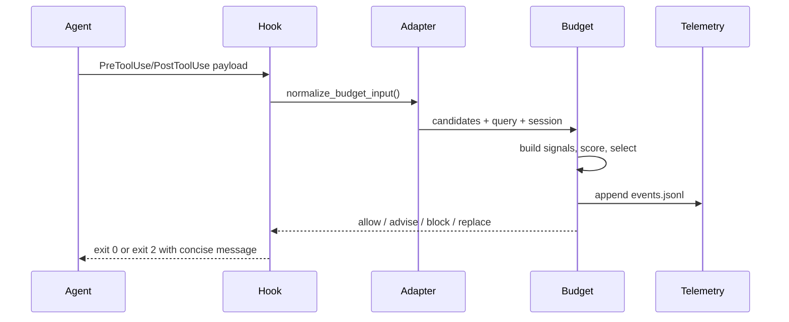

# HTML Documentation Plan

Plan for a static HTML documentation site that adds a richer engineer-facing documentation layer alongside the existing `less_tokens` docs. The site will include a high-level presentation layer and a deeper engineering reference. It should make the token-reduction strategies visible, but also show the scaffolding that makes those strategies enforceable, measurable, portable across Claude/Codex, and hard to drift.

## Goals

- Produce a polished, navigable HTML documentation site for engineers.
- Add an HTML documentation layer without replacing existing Markdown docs.
- Include a slide-like executive walkthrough of roughly 25 screens.
- Include full technical documentation sufficient for implementation, operation, debugging, and contribution.
- Link documentation sections to source code, generated registries, existing Markdown docs, and related sections.
- Use data-backed graphs where telemetry or source-of-truth registries exist; clearly label estimates and external dogfood data.
- Separate strategy behavior from scaffolding: hooks, adapters, budget plane, telemetry, installer, skills, generated docs, tests, and CI gates.

## Recommended Shape

Use a static docs site rather than a web app. The repo is Python/Markdown-first, so the least surprising build is:

- `docs-site/src/` for Markdown or HTML source pages.
- `docs-site/assets/` for CSS, logo images, diagrams, and generated JSON.
- `docs-site/scripts/` for small Python generators that read source registries and telemetry.
- `docs-site/site/` or `public/` for built HTML.

The site can start dependency-light with plain HTML/CSS plus bundled/generated SVG charts. If a docs framework is desired later, MkDocs Material is the best fit because the repo already treats Markdown as canonical and has many source-linked docs.

## Additive Policy

The HTML site is additive. Existing Markdown files remain in place and continue to serve their current roles.

Root docs after adding the HTML site:

- `README.md` remains the primary repository landing page and quick-start surface.
- `DOCUMENTATION.md` remains the full Markdown reference.
- `DECISIONS.md`, `BACKLOG.md`, and `CHANGELOG.md` remain working project records.
- `AGENTS.md` and `CLAUDE.md` stay minimal, preserving token discipline.
- The HTML site links back to these files and presents a richer navigable, visual, slide-friendly layer for peer engineers.

Additive rules:

- Do not remove, rename, or shrink existing docs as part of this work.
- Avoid copying large Markdown sections verbatim into static HTML when linking or generated summaries will do.
- Treat existing docs as source material and reference points, not content to retire.
- Use generated tables and diagrams where possible so the additive layer does not become a drift-prone second truth.
- Make clear when an HTML page is explanatory/visual and when the canonical operational detail still lives in `README.md` or `DOCUMENTATION.md`.

## Information Architecture

### 1. Overview

Purpose: a fast peer-engineer orientation.

Pages:

- `index.html` — what `less_tokens` does, why token waste happens, and the three token buckets: input, output, tool.
- `presentation.html` — slide-like high-level overview, around 25 sections.
- `strategy-map.html` — strategy matrix with links into implementation and telemetry.
- `architecture.html` — major runtime layers and agent split.

Primary code/doc links:

- [README.md](README.md)
- [DOCUMENTATION.md](DOCUMENTATION.md)
- [agents/common/hooks/hook_manifest.py](agents/common/hooks/hook_manifest.py)
- [agents/common/hooks/parity.json](agents/common/hooks/parity.json)

### 2. Strategies

Purpose: explain each token-reduction strategy, what bucket it attacks, how it is enforced, expected savings, trade-offs, and failure modes.

Pages:

- `strategies/index.html` — sortable strategy table generated from the strategy registry and hook manifest.
- `strategies/search-first.html`
- `strategies/vector-search-symbols.html`
- `strategies/read-guards.html`
- `strategies/context-cache.html`
- `strategies/lean-output-truncation.html`
- `strategies/terse-output.html`
- `strategies/compaction.html`
- `strategies/instruction-pruning.html`
- `strategies/budget-control-plane.html`

Each page should include:

- Problem statement.
- Before/after token flow.
- Triggering hook or command.
- Claude and Codex enforcement differences.
- Bypass or opt-out behavior.
- Telemetry emitted.
- Tests or verification points.
- Links to source files.

Primary code links:

- [agents/common/hooks/search_first.py](agents/common/hooks/search_first.py)
- [agents/common/hooks/auto_slice.py](agents/common/hooks/auto_slice.py)
- [agents/common/hooks/read_guard.py](agents/common/hooks/read_guard.py)
- [agents/common/hooks/grep_first_read.py](agents/common/hooks/grep_first_read.py)
- [agents/common/hooks/context_cache.py](agents/common/hooks/context_cache.py)
- [agents/common/hooks/truncate_output.py](agents/common/hooks/truncate_output.py)
- [agents/common/hooks/compact_trigger.py](agents/common/hooks/compact_trigger.py)
- [agents/common/hooks/response_budget.py](agents/common/hooks/response_budget.py)
- [agents/codex/hooks](agents/codex/hooks)

### 3. Scaffolding

Purpose: highlight the machinery that supports token reduction and keeps the project honest.

Pages:

- `scaffolding/installer.html` — install lifecycle, target detection, venv launchers, deployment map, update/check/uninstall.
- `scaffolding/hook-manifest.html` — `HOOK_SPECS` as source of truth, optional flags, event matchers, parity generation.
- `scaffolding/agent-adapters.html` — Claude direct hooks vs Codex adapters and payload normalization.
- `scaffolding/budget-plane.html` — candidate normalization, scoring, selection, advice/enforcement, telemetry.
- `scaffolding/telemetry.html` — savings log, budget events, reports, calibration caveats.
- `scaffolding/generated-docs.html` — registry-to-doc blocks and doc drift prevention.
- `scaffolding/skills.html` — Claude/Codex skills, AGENTS/CLAUDE pruning, subagent guidance.
- `scaffolding/testing-ci.html` — unit, integration, parity, generated-doc checks, protected telemetry.

Primary code links:

- [install.py](install.py)
- [agents/common/hooks/hook_manifest.py](agents/common/hooks/hook_manifest.py)
- [agents/common/hooks/payload.py](agents/common/hooks/payload.py)
- [agents/common/hooks/runtime.py](agents/common/hooks/runtime.py)
- [agents/common/budget/adapters.py](agents/common/budget/adapters.py)
- [agents/common/budget/gate.py](agents/common/budget/gate.py)
- [agents/common/budget/policy.py](agents/common/budget/policy.py)
- [agents/common/budget/config.py](agents/common/budget/config.py)
- [agents/common/budget/events.py](agents/common/budget/events.py)
- [agents/common/budget/compaction.py](agents/common/budget/compaction.py)
- [stats_plan.md](stats_plan.md)
- [eb_telemetry_9jul26.md](eb_telemetry_9jul26.md)

### 4. Reference

Purpose: complete engineer-facing documentation.

Pages:

- `reference/install.html`
- `reference/configuration.html`
- `reference/commands.html`
- `reference/hook-events.html`
- `reference/state-files.html`
- `reference/telemetry-schema.html`
- `reference/troubleshooting.html`
- `reference/contributing.html`
- `reference/decisions.html`
- `reference/backlog.html`

Primary doc links:

- [DOCUMENTATION.md](DOCUMENTATION.md)
- [DECISIONS.md](DECISIONS.md)
- [BACKLOG.md](BACKLOG.md)
- [CHANGELOG.md](CHANGELOG.md)

## Presentation Outline, About 25 Slides

`presentation.html` should behave like a technical slide deck: one viewport-height section per slide, concise visual explanation, deep links to reference pages.

1. Title: `less_tokens` as a token-control layer for coding agents.
2. The waste model: input, output, tool output, fixed instructions.
3. Why input dominates: full-file reads, history growth, repeated context.
4. Product promise: search first, slice narrowly, summarize or block waste.
5. System map: installer, hooks, index, budget plane, telemetry.
6. Strategy matrix: all shipped strategies at a glance.
7. Search-first workflow: question to vector chunks to targeted read.
8. Structural chunking: Python AST, headings, SQL, JS/TS declarations.
9. Symbol lookup: exact definitions instead of grep dumps.
10. Read guard stack: search-first, auto-slice, grep-first, noise-file guard.
11. Context cache: avoid reinjecting unchanged reads/searches.
12. Tool-output controls: lean parsers, truncation, directory listing guard.
13. Output controls: terse reminder and response budget.
14. Compaction controls: transcript threshold and pressure-based summaries.
15. Instruction pruning: lowering always-loaded fixed cost.
16. Budget control plane: normalize candidates, score relevance, select action.
17. Relevance scoring model: explicit, semantic, lexical, recency, structural, failure signals.
18. Enforcement modes: observe, advise, enforce, strict.
19. Agent split: Claude direct hooks vs Codex best-effort adapters.
20. Hook manifest: one registry to wire both agents.
21. Telemetry model: local-only savings logs and budget event streams.
22. Data slide: dogfood telemetry and measured/estimated caveats.
23. Drift prevention: generated docs, parity JSON, tests.
24. Operational playbook: install, verify, report, troubleshoot.
25. Contribution map: where to add a strategy and how to prove it.

## Diagrams

Use Mermaid for source-controlled diagrams first; export to SVG during build if standalone HTML should avoid external dependencies.

Required diagrams:

- Architecture layer diagram: source repo, deployed host project, `.claude`, `.less_tokens`, `.codex`.
- Hook execution sequence: tool payload to adapter to shared check to exit code/advice.
- Budget control sequence: normalize input, build signals, score candidates, select decision, emit telemetry, maybe compact.
- Search-first sequence: user need, search command, `last-search`, blocked broad read, targeted slice.
- Agent parity diagram: shared source of truth, Claude direct hooks, Codex adapters.
- Telemetry pipeline: savings events, budget events, report tools, HTML status/report.
- Strategy-to-bucket map: input/output/tool/fixed categories.
- Installer deployment map: source paths to destination paths.

Example budget sequence:

## Graphs And Data

Graphs should be generated from source or checked-in telemetry notes, not hand-drawn numbers.

Recommended graphs:

- Strategy coverage by agent: generated from [agents/common/hooks/hook_manifest.py](agents/common/hooks/hook_manifest.py) and [agents/common/hooks/parity.json](agents/common/hooks/parity.json).
- Savings strategy table: generated from strategy registry/README markers if available, with savings claims labeled as measured, estimated, or qualitative.
- Budget decision volume: from `.less_tokens/state/events.jsonl` when present; fallback to [eb_telemetry_9jul26.md](eb_telemetry_9jul26.md) as clearly labeled external dogfood evidence.
- Session-size distribution: from near-miss data if available; otherwise use the EB telemetry table with caveat.
- Legacy savings by strategy: use EB section showing search, context-cache-read, search-blocked, truncation event counts/chars.
- Hook surface area: count hooks by event type and agent from `HOOK_SPECS`.
- Documentation drift controls: count generated blocks and source registries.

Rules for data honesty:

- Label `chars / 4` token estimates as estimates.
- Keep measured compaction separate from budget-pressure estimated savings.
- Do not convert qualitative README savings claims into benchmark results.
- Mark EB telemetry as external dogfood data, not this repo's production telemetry.
- Link every graph to the source file or generated JSON used to render it.

## Hyperlinking Rules

Every strategy page should include a "Trace It In Code" box with links to:

- Source-of-truth registry or manifest.
- Shared hook implementation.
- Claude hook wrapper, when present.
- Codex hook wrapper, when present.
- Budget-plane code, if the strategy participates in budget decisions.
- Telemetry/logging code.
- Tests, when present.
- Related docs/reference page.

Use stable relative links in source Markdown/HTML. For generated line-number links, use a build script that can produce GitHub-style anchors when a repository URL is configured.

## Build Scripts

Add small generators so docs stay tied to code:

- `generate_hook_matrix.py`: import `HOOK_SPECS`, emit `hook-matrix.json`.
- `generate_strategy_matrix.py`: read the strategy registry or README strategy markers, emit `strategy-matrix.json`.
- `generate_budget_schema.py`: introspect dataclasses/default config, emit `budget-schema.json`.
- `generate_telemetry_summary.py`: summarize local telemetry when available, with an option to use checked-in EB telemetry notes for examples.
- `check_docs_links.py`: fail on broken internal links.
- `check_generated_docs.py`: verify generated tables match source registries.

## Implementation Phases

### Phase 1: Skeleton And Navigation

- Create docs source tree and base CSS.
- Add `index.html`, `presentation.html`, `architecture.html`, and reference landing pages.
- Reuse `LT_logo.png` / `LT_logo_small.png`.
- Add internal anchors and a site-wide search placeholder.

### Phase 2: Source-Generated Matrices

- Generate strategy, hook, parity, and deployment tables.
- Convert existing README/DOCUMENTATION tables into generated HTML blocks.
- Add graph data JSON and first SVG/Canvas charts.

### Phase 3: Deep Technical Pages

- Write strategy pages.
- Write scaffolding pages.
- Add "Trace It In Code" link boxes.
- Add troubleshooting and operational playbooks.

### Phase 4: Visual Polish And Verification

- Add responsive layout, print/PDF-friendly presentation mode, and dark/light themes.
- Run link checks.
- Verify all source-generated docs are reproducible.
- Add CI or a local check target.

### Phase 5: Maintenance Hooks

- Add docs generation checks alongside existing registry-to-doc checks.
- Document how contributors add a strategy, update the manifest, add telemetry, and update docs.

## Acceptance Criteria

- The presentation can be read in 10-15 minutes and covers the major features without requiring code reading.
- The reference docs answer how to install, configure, operate, troubleshoot, and extend the system.
- Every strategy has implementation links, telemetry notes, failure modes, and Claude/Codex parity notes.
- Graphs are generated from source data or explicitly labeled external/example data.
- Internal links pass a checker.
- Generated matrices are reproducible from code.
- The docs make scaffolding as visible as strategies: installer, adapters, manifest, budget plane, telemetry, skills, tests, and drift-prevention.
